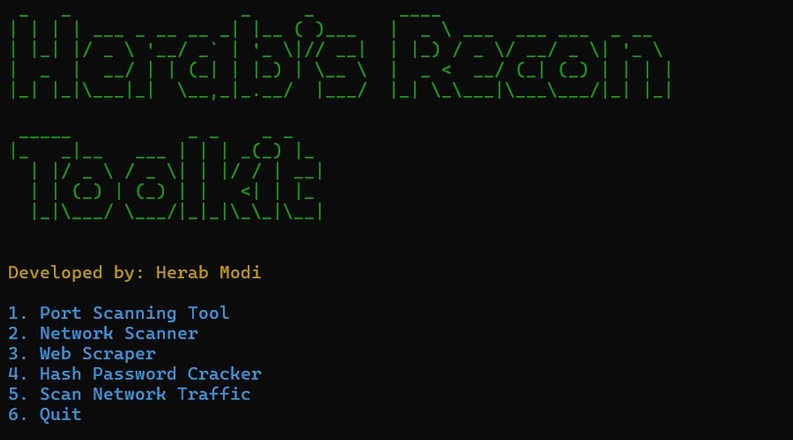
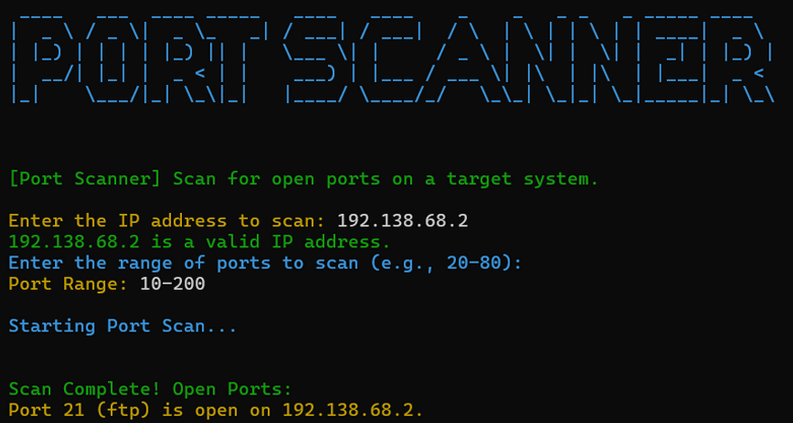
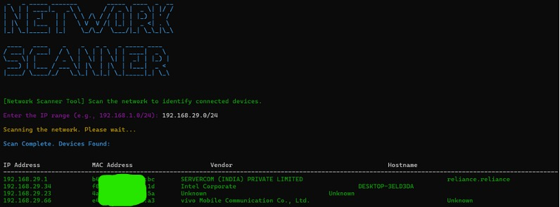
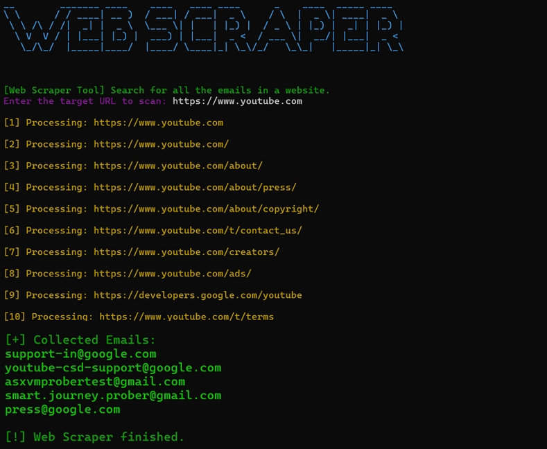
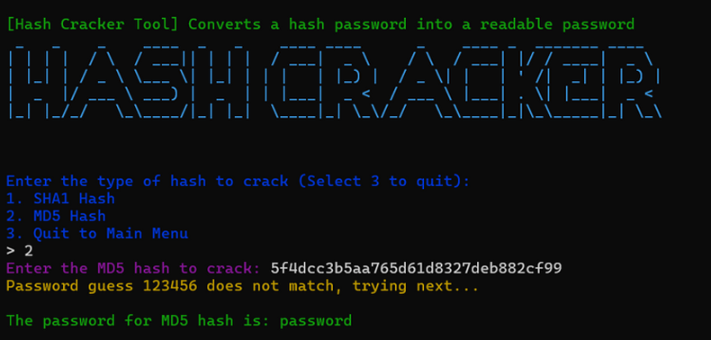
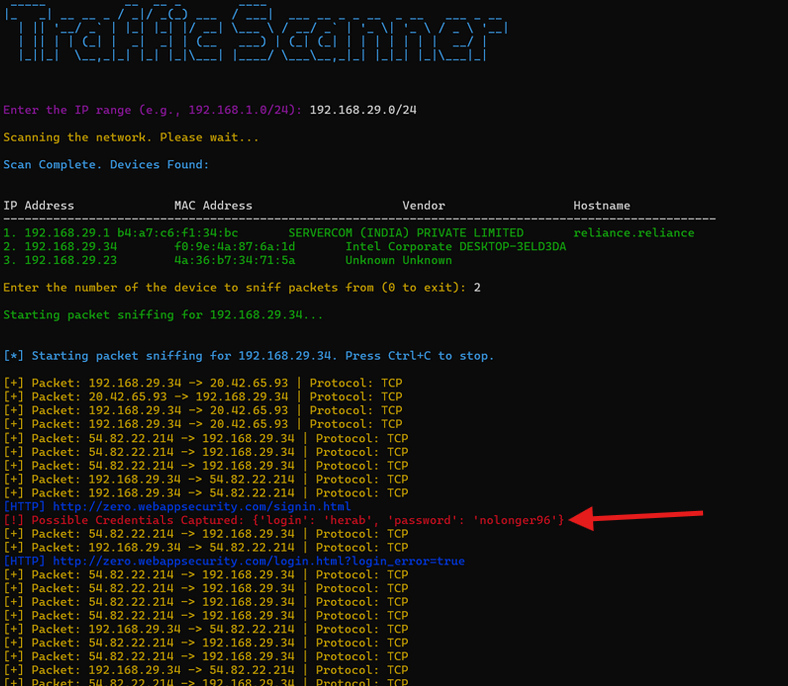

# 🦅 NetHawk — Network Pentesting & Recon Toolkit

> A multi-functional, terminal-based cybersecurity toolkit built in Python. Designed for network reconnaissance, traffic analysis, web scraping, and password hash cracking — all from a single interactive menu.

**Developed by: Herab Modi** | 3rd Year Diploma (Polytechnic) Major Project

---

## 📋 Table of Contents
- [About the Project](#about-the-project)
- [Features](#features)
- [Screenshots](#screenshots)
- [Requirements](#requirements)
- [Installation & Setup](#installation--setup)
- [How to Run](#how-to-run)
- [Tool Guide](#tool-guide)
- [Important Notes](#important-notes)
- [Project Structure](#project-structure)

---

## 📌 About the Project

**NetHawk** is a Python-based command-line toolkit that combines multiple network security and recon tools under one roof. It was built as a major project in the 3rd year of Diploma (Polytechnic) to demonstrate practical knowledge of networking, web technologies, and cybersecurity concepts.

> ⚠️ **Disclaimer:** This tool is built purely for **educational purposes**. Only use it on networks and systems you own or have explicit permission to test. Unauthorized use is illegal.

---

## ✨ Features

| # | Tool | Description |
|---|------|-------------|
| 1 | **Port Scanner** | Scans a target IP for open ports in a given range using multithreading |
| 2 | **Network Scanner** | Discovers all connected devices on a network via ARP requests (shows IP, MAC, Vendor, Hostname) |
| 3 | **Web Scraper** | Crawls a website and extracts all email addresses found across its pages |
| 4 | **Hash Password Cracker** | Attempts to crack SHA1 and MD5 hashes using a wordlist dictionary attack |
| 5 | **Network Traffic Scanner** | Sniffs live network packets and captures HTTP traffic + potential credentials in transit |
| 6 | **Quit** | Exit the toolkit |

---

## 📸 Screenshots

> **Main Menu & Port Scanner:**



> **Network Scanner, Web Scraper, Hash Cracker & Traffic Scanner:**








---

## ⚙️ Requirements

### 🐍 Python
- **Python 3.8 or above**
- Download: https://www.python.org/downloads/
- ✅ During installation, check **"Add Python to PATH"**

### 📦 Python Libraries
All required libraries are listed in `requirements.txt`:

| Library | Purpose |
|---------|---------|
| `colorama` | Cross-platform colored terminal output |
| `pyfiglet` | ASCII art banners |
| `termcolor` | Colored text in terminal |
| `beautifulsoup4` | HTML parsing for web scraper |
| `requests` | HTTP requests for web scraper |
| `scapy` | Network packet crafting, ARP scanning & sniffing |
| `mac-vendor-lookup` | Resolves MAC address to device vendor name |
| `lxml` | HTML/XML parser (used by BeautifulSoup) |

### 🪟 Npcap (Windows Only — Required for Scapy)
Scapy requires **Npcap** to capture and send packets on Windows.

- **Download:** https://npcap.com/#download  *(or use the included `npcap-1.80.exe`)*
- **Install with default settings** — make sure to check **"WinPcap API-compatible mode"** during installation
- Without Npcap, the Network Scanner and Traffic Scanner tools **will not work**

---

## 🚀 Installation & Setup

### Step 1 — Install Npcap (Windows)
Run `npcap-1.80.exe` included in this repo and install with default settings.

### Step 2 — Install Python Libraries
Open a terminal/command prompt in the project folder and run:

```bash
pip install -r requirements.txt
```

This installs all required libraries in one command.

### Step 3 — Set up the Wordlist (for Hash Cracker)
The Hash Cracker tool uses `password.txt` as its password wordlist.

- Make sure `password.txt` is in the **same folder** as `NetHawk.py`
If you want to use any different wordlist you can go to line 226 in "NetHawk.py" and give its location in:
```bash
with open("ENTER_THE_PATH_OF_YOUR_WORDLIST.txt", "r") as file:
```
---

## ▶️ How to Run

> ⚠️ **Run as Administrator** — Network Scanner and Traffic Scanner require admin/root privileges to send ARP packets and sniff traffic.

**Windows (Run as Administrator):**
```bash
python NetHawk.py
```

**Linux/macOS (Run as root):**
```bash
sudo python3 Net_Hawk.py
```

---

## 🛠️ Tool Guide

### 1. 🔍 Port Scanner
- Enter a target IP address (e.g., `192.168.1.1`)
- Enter a port range (e.g., `20-1000`)
- The tool scans all ports in that range using multithreading and lists all open ones

### 2. 📡 Network Scanner
- Enter an IP range in CIDR notation (e.g., `192.168.1.0/24`)
- Sends ARP broadcast packets and lists all responding devices
- Shows: IP address, MAC address, Device Vendor, Hostname

### 3. 🌐 Web Scraper
- Enter a target website URL (e.g., `https://example.com`)
- Crawls up to 100 pages on that site
- Collects and displays all email addresses found

### 4. 🔓 Hash Password Cracker
- Choose hash type: **SHA1** or **MD5**
- Enter the hash value to crack
- The tool compares it against every password in `password.txt` (dictionary attack)
- Works only if the original password is present in the wordlist

### 5. 📶 Network Traffic Scanner
- Enter an IP range (e.g., `192.168.1.0/24`) to discover devices first
- Select a device number to sniff
- Captures live TCP/UDP packets for that IP
- Detects and displays HTTP URLs and potential login credentials sent over unencrypted HTTP

---

## ⚠️ Important Notes

- **Run as Administrator/root** is required for tools 2 and 5 (ARP + packet sniffing)
- The Hash Cracker only works for passwords present in the wordlist — it's a **dictionary attack**, not brute force
- The Traffic Scanner only captures **unencrypted HTTP traffic** — HTTPS traffic is encrypted and not readable
- Scapy on Windows requires **Npcap** — without it, tools 2 and 5 will crash
- This tool is for **educational and authorized testing only**

---

## 📁 Project Structure

```
nethawk/
│
├── NetHawk.py          # Main Python script
├── requirements.txt       # All required Python libraries
├── password.txt               # Password wordlist for Hash Cracker
├── npcap-1.80.exe         # Npcap installer for Windows (required for Scapy)
├── screenshots/           # Output screenshots
│   ├── screenshot1.jpeg
│   └── screenshot2.jpeg
└── README.md              # This file
```

---

## 🧑‍💻 Author

**Herab Modi**
- 3rd Year Diploma (Polytechnic) — Major Project
- Built with Python 3 | Cybersecurity & Networking
